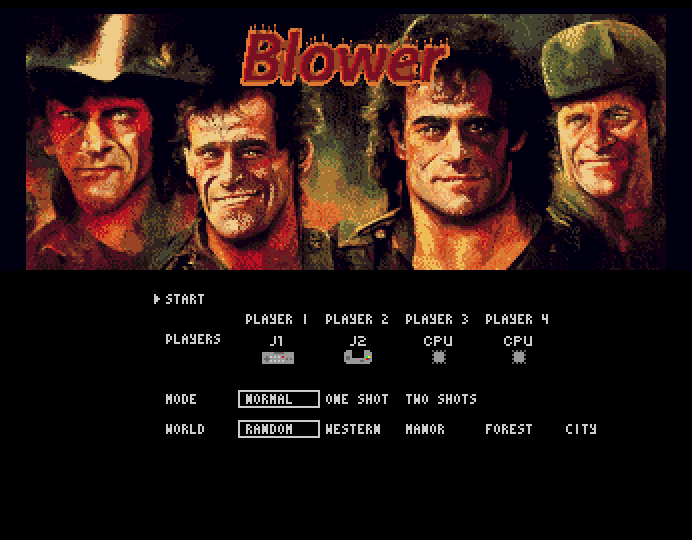
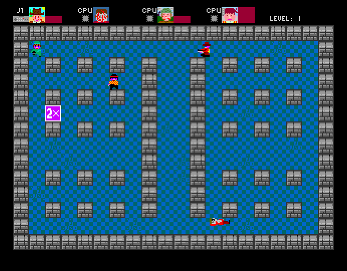
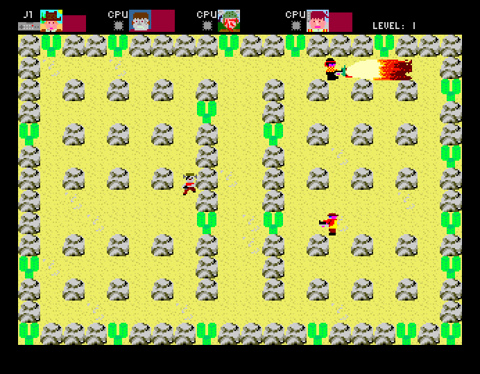
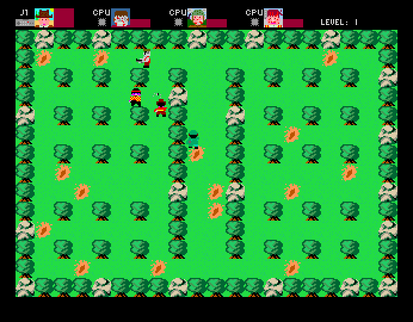
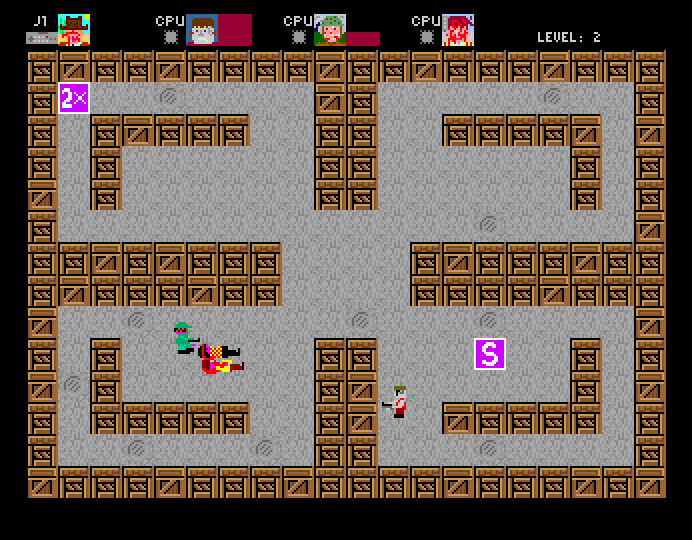
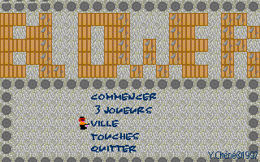
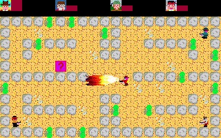
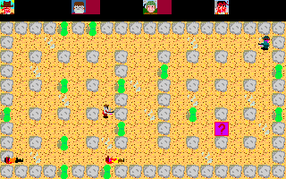
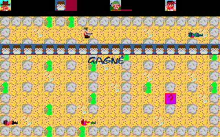

# Blower - Amiga Port

## Story

Blower is a **local multiplayer game**, a **Bomberman** x **Doom** game. Let's say a Doom like with 2D bomberman fashion, or a Bomberman without bombs but with guns and flamethrower.

It's was initially designed in the **computer room** of my **high school** on **PC MS/DOS** and written in **Pascal** and inline **x86 assembly**. I got help from friends as Guillaume, Donatien and Aurélien.

It was initially created in **1996/1997**, so you can feel the **action movie legacy** of the 80's and early 90's with all Arnold Schwarzenegger, Silvester Stallone, Bruce Willis, Kurt Russel, Steven Seagal. The new title screen and the music were chosen to highlight this legacy. In 1996, it was **unconscious** as it was one of the main pop culture of the last 15 years, reworking on this in 2022, I make it more "meta" and more like a **parody**.

This version is a port to **Amiga** created for the [Amiga Blitz Basic Game Jam](https://itch.io/jam/abbgjam).

I hope you'll get a little fun with this game.

## Game Hightlights

- Compatible with all **Amiga** with 1 Mb of chip (Tested on CDTV, Amiga 500, Amiga 1200 and CDTV).
- up to **4 players** using a parallel port to joysticks adapter for player 3 & 4.
- missing player are replaced by (not very smart) **bots**.
- **4** different **avatars**/fighters (almost Rambo, almost Clint Eastwood, almost Frankenstein, almost an american soldier).
- **4 world** themes.
- **7 levels** to make the difference.
- **3** game **modes**.
- **7** types of **Bonus**.

## Download

Available on [AmigaLive](https://www.amigalive.com/) for remote multiplay.

On itch.io to pay me a beer https://youenchene.itch.io/blower

[ADF](./release/1.0.1/Blower.adf)

[Zip file for HardDisk installation](./release/1.0.1/Blower_HD.zip)

[ISO for CDTV](./release/1.0.1/Blower_CDTV.iso)

[ISO for CD32](./release/1.0.1/Blower_32.iso)

## How to play

4 players can fight in the same time using joystick or joypad using the two DB9/Joystick port of your Amiga. The 2 extra players can play using an parallel/joytsickport adapter.

If your are not four players, you can use bot for fun or training. (Warning they can be quite stupid).

You use the joystick to move your avatar, fire to shoot (yes that easy!) and go through bonus to make the difference.

Rules :
- 1 level = 1 game = the survivor wins the game and get one point.
- 7 levels.
- the player with the more points win the party.

Game mode :
- Normal.
- One shot : 1 hit and you're dead, for blitz game party.
- Two shots : 2 hits and you're dead, a good compromise between the 2 other modes.

Bonus :
 - E : **Energy**, get back to full energy/life.
 - S : **Speed**, get an extra speed for 4 seconds.
 - F : **Flamethrower**, get a flamethrower instead of the gun for 4 seconds.
 - I : **Invicible**, you cannot be hit for 4 seconds.
 - 1x : **One shot to kill**, each shot take all life of the hit player for 4 seconds.
 - 2x : **Two shost to kill**, each shot take half life of the hit player for 4 seconds.
 - ? : **Random**, you get a random bonus.

## Credits

**Music** : Sunset Rebels from **Roald Strauss** - Discover https://indiegamemusic.com/ - Briging music artists and game developers together.

**GrafX** : contributions from **TheoTheoderich**.

Big thanks to the Amiga Blitz Basic Game Jam Discord community and Halifax Discord Community.

## Tools used

**Title Screen** : Midjourney & Grafx2.

**Grafx** : Paint on Windows 3.1 in 1996 and GrafX2.

**SoundFX** : iPhone with its native recording app, audacity.

**Code & Packaging** : [Amiga Blitz Basic 2 Language Support - Javascript Native Edition](https://marketplace.visualstudio.com/items?itemName=mickgyver.amiga-blitzbasic2#review-details), [FS-UAE](https://fs-uae.net/) & [Ultimate Blitz Basic 2.1](http://ubb.plus/)

## Difference with 1997 PC version

Amiga Port  got the following change : 
 - **Grafx** were "downgraded" from 256 color, and upgraded with the help of TheoTheoderich.
 - **Sound** was upgraded from nothing (you know PC in the 90's, you need extra money to have a Sound Blaster) to Sound FX recorded with my two sons (Léo and Noah) with their toys and our ability to make sound with our mouths.
 - **Music** was added (same reason).
 - New **Title Screen**.
 - **Bot** was also added (on the PC port it was multiplayer only).
 - **Scores** and **3 extra levels** were added.
 - **2 new  bonus** were added.

Original screen shots :

## Press Releases

### English

- Saberman Youtube Channel : https://www.youtube.com/watch?v=l7UhM_wkf4I
- Indie Retro News : https://www.indieretronews.com/2022/11/blower-bomberman-clone-for-commodore.html
- Reddit Post : https://www.reddit.com/r/amiga/comments/yigd28/discovered_a_new_ported_game_on_itchio_blower/

### French :

- Amiga France : https://www.amigafrance.com/forums/topic/blower/
- MO5.com : https://mag.mo5.com/233955/neonnoir-et-autres-jeux-de-lamiga-blitz-basic-game-jam/
- Gamopat : https://www.gamopat.com/2022/11/le-blitz-basic-toujours-vaillant-sur-amiga.html

### German

- Radio PARALAX - RetroVision - Plug & Play #118 : https://www.youtube.com/watch?v=wYMwnlSGA0Y&t=19265s